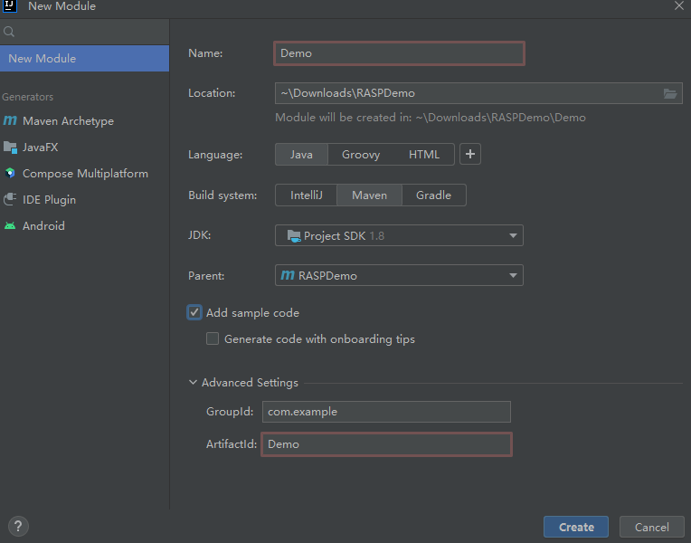

## Java agent IDEA运行示例
1、打开IDEA 创建Maven项目
2、删除src及其子目录
3、 创建一个module 命名为Agent




新建个PreMain类
```java
package com.example;

import java.lang.instrument.ClassFileTransformer;
import java.lang.instrument.IllegalClassFormatException;
import java.lang.instrument.Instrumentation;
import java.security.ProtectionDomain;

public class PreMain {
    public static void premain(String agentArgs, Instrumentation inst) {
        System.out.println("agentArgs:" + agentArgs);
        inst.addTransformer(new DefineTransformer(), true);
    }

    static class DefineTransformer implements ClassFileTransformer {
        @Override
        public byte[] transform(ClassLoader loader, String className, Class<?> classBeingRedefined, ProtectionDomain protectionDomain, byte[] classfileBuffer) throws IllegalClassFormatException {
            System.out.println("premain load Class: " + className);  // 注意这里的输出
            return classfileBuffer;
        }
    }
}
```
pom.xml中添加如下内容：
```xml
    <build>
        <plugins>
            <plugin>
                <groupId>org.apache.maven.plugins</groupId>
                <artifactId>maven-jar-plugin</artifactId>
                <configuration>
                    <archive>
                        <manifestEntries>
                            <Premain-Class>org.example.PreMain</Premain-Class>
                            <Can-Redefine-Classes>true</Can-Redefine-Classes>
                            <Can-Retransform-Classes>true</Can-Retransform-Classes>
                        </manifestEntries>
                    </archive>
                </configuration>
            </plugin>
        </plugins>
    </build>
```
然后直接maven->package打包编译成jar包。
同样的方法，创建一个Demo module，代码就不再赘述，生成jar包。


执行命令：
 `java -javaagent:.\Agent\target\Agent-1.0-SNAPSHOT.jar -jar .\Demo\target\Demo-1.0-SNAPSHOT.jar
`
```java
agentArgs:null
premain load Class: java/lang/invoke/MethodHandleImpl
premain load Class: java/lang/invoke/MethodHandleImpl$1
premain load Class: java/lang/invoke/MethodHandleImpl$2
premain load Class: java/util/function/Function
premain load Class: java/lang/invoke/MethodHandleImpl$3
premain load Class: java/lang/invoke/MethodHandleImpl$4
premain load Class: java/lang/ClassValue
premain load Class: java/lang/ClassValue$Entry
premain load Class: java/lang/ClassValue$Identity
premain load Class: java/lang/ClassValue$Version
premain load Class: java/lang/invoke/MemberName$Factory
premain load Class: java/lang/invoke/MethodHandleStatics
premain load Class: java/lang/invoke/MethodHandleStatics$1
premain load Class: sun/misc/PostVMInitHook
premain load Class: sun/usagetracker/UsageTrackerClient
premain load Class: java/util/concurrent/atomic/AtomicBoolean
premain load Class: sun/usagetracker/UsageTrackerClient$1
premain load Class: sun/usagetracker/UsageTrackerClient$4
premain load Class: sun/usagetracker/UsageTrackerClient$2
premain load Class: jdk/internal/util/EnvUtils
premain load Class: sun/usagetracker/UsageTrackerClient$3
premain load Class: java/io/FileOutputStream$1
premain load Class: sun/launcher/LauncherHelper
premain load Class: java/util/concurrent/ConcurrentHashMap$ForwardingNode
premain load Class: org/example/Main
premain load Class: sun/launcher/LauncherHelper$FXHelper
premain load Class: java/lang/Class$MethodArray
premain load Class: java/lang/Void
premain load Class: java/util/Formatter
premain load Class: java/util/regex/Pattern$GroupTail
premain load Class: java/util/regex/Pattern$Ctype
premain load Class: java/util/regex/Pattern$Curly
premain load Class: java/util/regex/Pattern$Ques
premain load Class: java/util/regex/Pattern$BitClass
premain load Class: java/util/regex/Pattern$1
premain load Class: java/util/regex/Pattern$5
premain load Class: java/util/Locale$Category
premain load Class: java/util/Locale$1
premain load Class: java/text/DecimalFormatSymbols
premain load Class: java/text/spi/DecimalFormatSymbolsProvider
premain load Class: java/util/spi/LocaleServiceProvider
premain load Class: sun/util/locale/provider/LocaleProviderAdapter
premain load Class: sun/util/locale/provider/JRELocaleProviderAdapter
premain load Class: sun/util/locale/provider/ResourceBundleBasedAdapter
premain load Class: sun/util/locale/provider/SPILocaleProviderAdapter
premain load Class: sun/util/locale/provider/AuxLocaleProviderAdapter
premain load Class: sun/util/locale/provider/AuxLocaleProviderAdapter$NullProvider
premain load Class: sun/util/locale/provider/LocaleProviderAdapter$Type
premain load Class: java/util/Collections$UnmodifiableCollection$1
premain load Class: java/util/ArrayList$Itr
premain load Class: sun/util/locale/provider/LocaleProviderAdapter$1
premain load Class: sun/util/locale/provider/DecimalFormatSymbolsProviderImpl
premain load Class: sun/util/locale/provider/AvailableLanguageTags
premain load Class: sun/util/locale/provider/LocaleDataMetaInfo
premain load Class: sun/util/locale/provider/JRELocaleProviderAdapter$1
premain load Class: sun/util/locale/LanguageTag
premain load Class: java/util/Collections$EmptyIterator
premain load Class: sun/util/locale/provider/LocaleResources
premain load Class: sun/util/resources/LocaleData
premain load Class: sun/util/resources/LocaleData$1
premain load Class: sun/util/resources/LocaleData$LocaleDataResourceBundleControl
premain load Class: java/util/ResourceBundle$Control
premain load Class: java/util/Arrays$ArrayList
premain load Class: java/util/ResourceBundle$Control$CandidateListCache
premain load Class: java/util/ResourceBundle
premain load Class: java/util/ResourceBundle$1
premain load Class: java/util/spi/ResourceBundleControlProvider
premain load Class: java/util/ServiceLoader
premain load Class: java/util/ServiceLoader$LazyIterator
premain load Class: java/util/ServiceLoader$1
premain load Class: java/util/LinkedHashMap$LinkedEntrySet
premain load Class: java/util/LinkedHashMap$LinkedEntryIterator
premain load Class: java/util/LinkedHashMap$LinkedHashIterator
premain load Class: sun/misc/Launcher$BootClassPathHolder
premain load Class: sun/misc/Launcher$BootClassPathHolder$1
premain load Class: sun/misc/URLClassPath$2
premain load Class: java/lang/ClassLoader$2
premain load Class: sun/misc/URLClassPath$1
premain load Class: java/net/URLClassLoader$3
premain load Class: sun/misc/CompoundEnumeration
premain load Class: java/io/FileNotFoundException
premain load Class: java/io/IOException
premain load Class: java/security/PrivilegedActionException
premain load Class: java/net/URLClassLoader$3$1
premain load Class: java/util/ResourceBundle$RBClassLoader
premain load Class: java/util/ResourceBundle$RBClassLoader$1
premain load Class: java/util/ResourceBundle$CacheKey
premain load Class: java/util/ResourceBundle$LoaderReference
premain load Class: java/util/ResourceBundle$CacheKeyReference
premain load Class: java/util/ResourceBundle$SingleFormatControl
premain load Class: sun/text/resources/FormatData
premain load Class: sun/util/resources/ParallelListResourceBundle
premain load Class: java/util/concurrent/atomic/AtomicMarkableReference
premain load Class: java/util/concurrent/atomic/AtomicMarkableReference$Pair
premain load Class: java/util/ResourceBundle$BundleReference
premain load Class: sun/text/resources/zh/FormatData_zh
premain load Class: sun/text/resources/zh/FormatData_zh_CN
premain load Class: sun/util/resources/ParallelListResourceBundle$KeySet
premain load Class: sun/util/locale/provider/LocaleResources$ResourceReference
premain load Class: java/util/Currency
premain load Class: java/util/Currency$1
premain load Class: java/io/DataInputStream
premain load Class: java/io/DataInput
premain load Class: java/util/spi/CurrencyNameProvider
premain load Class: sun/util/locale/provider/LocaleServiceProviderPool
premain load Class: java/text/spi/BreakIteratorProvider
premain load Class: java/text/spi/CollatorProvider
premain load Class: java/text/spi/DateFormatProvider
premain load Class: java/text/spi/DateFormatSymbolsProvider
premain load Class: java/text/spi/NumberFormatProvider
premain load Class: java/util/spi/LocaleNameProvider
premain load Class: sun/util/resources/OpenListResourceBundle
premain load Class: sun/util/resources/zh/CurrencyNames_zh_CN
premain load Class: java/util/HashMap$KeySet
premain load Class: java/util/Formatter$FixedString
premain load Class: java/util/Formatter$FormatString
Hello and welcome!i = 1
i = 2
i = 3
i = 4
i = 5

```