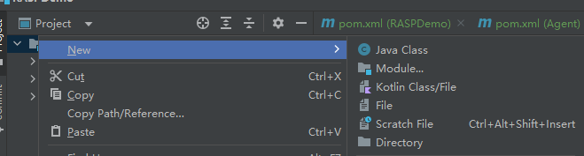

## Java agent IDEA运行示例
1、打开IDEA 创建Maven项目
2、删除src及其子目录
3、 创建一个module 命名为Agent




新建个PreMain类
```java
package com.example;

import java.lang.instrument.ClassFileTransformer;
import java.lang.instrument.IllegalClassFormatException;
import java.lang.instrument.Instrumentation;
import java.security.ProtectionDomain;

public class PreMain {
    public static void premain(String agentArgs, Instrumentation inst) {
        System.out.println("agentArgs:" + agentArgs);
        inst.addTransformer(new DefineTransformer(), true);
    }

    static class DefineTransformer implements ClassFileTransformer {
        @Override
        public byte[] transform(ClassLoader loader, String className, Class<?> classBeingRedefined, ProtectionDomain protectionDomain, byte[] classfileBuffer) throws IllegalClassFormatException {
            System.out.println("premain load Class: " + className);  // 注意这里的输出
            return classfileBuffer;
        }
    }
}
```
pom.xml中添加如下内容：
```xml
    <build>
        <plugins>
            <plugin>
                <groupId>org.apache.maven.plugins</groupId>
                <artifactId>maven-jar-plugin</artifactId>
                <configuration>
                    <archive>
                        <manifestEntries>
                            <Premain-Class>org.example.PreMain</Premain-Class>
                            <Can-Redefine-Classes>true</Can-Redefine-Classes>
                            <Can-Retransform-Classes>true</Can-Retransform-Classes>
                        </manifestEntries>
                    </archive>
                </configuration>
            </plugin>
        </plugins>
    </build>
```
然后直接maven->package打包编译成jar包。
同样的方法，创建一个Demo module，代码就不再赘述，生成jar包。


执行命令：
 `java -javaagent:.\Agent\target\Agent-1.0-SNAPSHOT.jar -jar .\Demo\target\Demo-1.0-SNAPSHOT.jar
`
```java
agentArgs:null
premain load Class: java/lang/invoke/MethodHandleImpl
premain load Class: java/lang/invoke/MethodHandleImpl$1
premain load Class: java/lang/invoke/MethodHandleImpl$2
premain load Class: java/util/function/Function
premain load Class: java/lang/invoke/MethodHandleImpl$3
premain load Class: java/lang/invoke/MethodHandleImpl$4
premain load Class: java/lang/ClassValue
premain load Class: java/lang/ClassValue$Entry
premain load Class: java/lang/ClassValue$Identity
premain load Class: java/lang/ClassValue$Version
premain load Class: java/lang/invoke/MemberName$Factory
premain load Class: java/lang/invoke/MethodHandleStatics
premain load Class: java/lang/invoke/MethodHandleStatics$1
premain load Class: sun/misc/PostVMInitHook
premain load Class: sun/usagetracker/UsageTrackerClient
premain load Class: java/util/concurrent/atomic/AtomicBoolean
premain load Class: sun/usagetracker/UsageTrackerClient$1
premain load Class: sun/usagetracker/UsageTrackerClient$4
premain load Class: sun/usagetracker/UsageTrackerClient$2
premain load Class: jdk/internal/util/EnvUtils
premain load Class: sun/usagetracker/UsageTrackerClient$3
premain load Class: java/io/FileOutputStream$1
premain load Class: sun/launcher/LauncherHelper
premain load Class: java/util/concurrent/ConcurrentHashMap$ForwardingNode
premain load Class: org/example/Main
premain load Class: sun/launcher/LauncherHelper$FXHelper
premain load Class: java/lang/Class$MethodArray
premain load Class: java/lang/Void
premain load Class: java/util/Formatter
premain load Class: java/util/regex/Pattern$GroupTail
premain load Class: java/util/regex/Pattern$Ctype
premain load Class: java/util/regex/Pattern$Curly
premain load Class: java/util/regex/Pattern$Ques
premain load Class: java/util/regex/Pattern$BitClass
premain load Class: java/util/regex/Pattern$1
premain load Class: java/util/regex/Pattern$5
premain load Class: java/util/Locale$Category
premain load Class: java/util/Locale$1
premain load Class: java/text/DecimalFormatSymbols
premain load Class: java/text/spi/DecimalFormatSymbolsProvider
premain load Class: java/util/spi/LocaleServiceProvider
premain load Class: sun/util/locale/provider/LocaleProviderAdapter
premain load Class: sun/util/locale/provider/JRELocaleProviderAdapter
premain load Class: sun/util/locale/provider/ResourceBundleBasedAdapter
premain load Class: sun/util/locale/provider/SPILocaleProviderAdapter
premain load Class: sun/util/locale/provider/AuxLocaleProviderAdapter
premain load Class: sun/util/locale/provider/AuxLocaleProviderAdapter$NullProvider
premain load Class: sun/util/locale/provider/LocaleProviderAdapter$Type
premain load Class: java/util/Collections$UnmodifiableCollection$1
premain load Class: java/util/ArrayList$Itr
premain load Class: sun/util/locale/provider/LocaleProviderAdapter$1
premain load Class: sun/util/locale/provider/DecimalFormatSymbolsProviderImpl
premain load Class: sun/util/locale/provider/AvailableLanguageTags
premain load Class: sun/util/locale/provider/LocaleDataMetaInfo
premain load Class: sun/util/locale/provider/JRELocaleProviderAdapter$1
premain load Class: sun/util/locale/LanguageTag
premain load Class: java/util/Collections$EmptyIterator
premain load Class: sun/util/locale/provider/LocaleResources
premain load Class: sun/util/resources/LocaleData
premain load Class: sun/util/resources/LocaleData$1
premain load Class: sun/util/resources/LocaleData$LocaleDataResourceBundleControl
premain load Class: java/util/ResourceBundle$Control
premain load Class: java/util/Arrays$ArrayList
premain load Class: java/util/ResourceBundle$Control$CandidateListCache
premain load Class: java/util/ResourceBundle
premain load Class: java/util/ResourceBundle$1
premain load Class: java/util/spi/ResourceBundleControlProvider
premain load Class: java/util/ServiceLoader
premain load Class: java/util/ServiceLoader$LazyIterator
premain load Class: java/util/ServiceLoader$1
premain load Class: java/util/LinkedHashMap$LinkedEntrySet
premain load Class: java/util/LinkedHashMap$LinkedEntryIterator
premain load Class: java/util/LinkedHashMap$LinkedHashIterator
premain load Class: sun/misc/Launcher$BootClassPathHolder
premain load Class: sun/misc/Launcher$BootClassPathHolder$1
premain load Class: sun/misc/URLClassPath$2
premain load Class: java/lang/ClassLoader$2
premain load Class: sun/misc/URLClassPath$1
premain load Class: java/net/URLClassLoader$3
premain load Class: sun/misc/CompoundEnumeration
premain load Class: java/io/FileNotFoundException
premain load Class: java/io/IOException
premain load Class: java/security/PrivilegedActionException
premain load Class: java/net/URLClassLoader$3$1
premain load Class: java/util/ResourceBundle$RBClassLoader
premain load Class: java/util/ResourceBundle$RBClassLoader$1
premain load Class: java/util/ResourceBundle$CacheKey
premain load Class: java/util/ResourceBundle$LoaderReference
premain load Class: java/util/ResourceBundle$CacheKeyReference
premain load Class: java/util/ResourceBundle$SingleFormatControl
premain load Class: sun/text/resources/FormatData
premain load Class: sun/util/resources/ParallelListResourceBundle
premain load Class: java/util/concurrent/atomic/AtomicMarkableReference
premain load Class: java/util/concurrent/atomic/AtomicMarkableReference$Pair
premain load Class: java/util/ResourceBundle$BundleReference
premain load Class: sun/text/resources/zh/FormatData_zh
premain load Class: sun/text/resources/zh/FormatData_zh_CN
premain load Class: sun/util/resources/ParallelListResourceBundle$KeySet
premain load Class: sun/util/locale/provider/LocaleResources$ResourceReference
premain load Class: java/util/Currency
premain load Class: java/util/Currency$1
premain load Class: java/io/DataInputStream
premain load Class: java/io/DataInput
premain load Class: java/util/spi/CurrencyNameProvider
premain load Class: sun/util/locale/provider/LocaleServiceProviderPool
premain load Class: java/text/spi/BreakIteratorProvider
premain load Class: java/text/spi/CollatorProvider
premain load Class: java/text/spi/DateFormatProvider
premain load Class: java/text/spi/DateFormatSymbolsProvider
premain load Class: java/text/spi/NumberFormatProvider
premain load Class: java/util/spi/LocaleNameProvider
premain load Class: sun/util/resources/OpenListResourceBundle
premain load Class: sun/util/resources/zh/CurrencyNames_zh_CN
premain load Class: java/util/HashMap$KeySet
premain load Class: java/util/Formatter$FixedString
premain load Class: java/util/Formatter$FormatString
Hello and welcome!i = 1
i = 2
i = 3
i = 4
i = 5

```


pom.xml中添加内容解释：
```xml
    <build>
        <plugins>
            <plugin>
                <groupId>org.apache.maven.plugins</groupId>
                <artifactId>maven-jar-plugin</artifactId>
                <configuration>
                    <archive>
                        <manifestEntries>
                            <Premain-Class>org.example.PreMain</Premain-Class>
                            <Can-Redefine-Classes>true</Can-Redefine-Classes>
                            <Can-Retransform-Classes>true</Can-Retransform-Classes>
                        </manifestEntries>
                    </archive>
                </configuration>
            </plugin>
        </plugins>
    </build>
```

这是一个 Maven 项目的 pom.xml 文件中的一段配置，主要作用是在打包生成的 Jar 包中添加一些 Manifest 属性，以支持在 Java 虚拟机启动时加入代理类（PreMain-Class）以及允许使用类重定义和转换器重转换功能。

具体来说，这段配置通过 maven-jar-plugin 插件实现，其中：

<Premain-Class> 指定了代理类的全限定名，该类会在应用程序启动之前被 JVM 加载并且执行 premain() 方法；
<Can-Redefine-Classes> 和 <Can-Retransform-Classes> 分别指定了 JVM 是否允许在运行时重新定义类和重新转换类。如果设置为 true，则代表允许这些操作；否则，禁止这些操作。
总体来说，这段配置的作用是为 Java 应用程序添加一些代理和调试能力，方便开发者在调试和测试代码时进行一些特殊的操作。


```java
    static class DefineTransformer implements ClassFileTransformer {
        @Override
        public byte[] transform(ClassLoader loader, String className, Class<?> classBeingRedefined, ProtectionDomain protectionDomain, byte[] classfileBuffer) throws IllegalClassFormatException {
            System.out.println("premain load Class: " + className);  // 注意这里的输出
            return classfileBuffer;
        }
    } 
```

上述代码定义了一个静态内部类 DefineTransformer，实现了 ClassFileTransformer 接口。ClassFileTransformer 接口是 Java Instrumentation API 的一部分，用于在加载类文件时进行转换和修改。

该类的作用是在类加载过程中对指定的类进行转换，并输出加载的类名。具体来说：

transform 方法是 ClassFileTransformer 接口定义的方法，在类加载过程中会被回调。它接收以下参数：
loader：类加载器，加载当前类的类加载器。
className：正在被加载的类的全限定名。
classBeingRedefined：如果是正在重新定义的类，则为正在重新定义的类；否则为 null。
protectionDomain：保护域，描述了代码源、权限等信息。
classfileBuffer：类文件的字节码数组。
在方法内部，代码简单地将正在加载的类的全限定名打印出来，以便开发者观察加载的过程。然后，原样返回类文件的字节码数组，表示不对类文件做任何修改。

这段代码通常与上述 Maven 配置中的 <Premain-Class> 相结合使用，作为 Java Agent 的一部分，用于在 JVM 启动时通过 -javaagent 参数加载并执行预定义的代理类和转换器。


```java
public class CommandExecutionFilter implements ClassFileTransformer {
    private static final String[] FILTER_CLASSES = {"java/lang/Runtime", "java/lang/ProcessBuilder"};

    @Override
    public byte[] transform(ClassLoader loader, String className, Class<?> classBeingRedefined, ProtectionDomain protectionDomain, byte[] classfileBuffer) throws IllegalClassFormatException {
        for (String filterClass : FILTER_CLASSES) {
            if (className.equals(filterClass)) {
                System.out.println("Loading of " + className + " is blocked.");
                throw new IllegalClassFormatException(className + " is not allowed to be loaded.");
            }
        }
        return classfileBuffer;
    }
}
```
在上述代码中，我们定义了一个名为 CommandExecutionFilter 的类，它实现了 ClassFileTransformer 接口。在 transform 方法中，我们检查正在加载的类是否在 FILTER_CLASSES 数组中。如果加载的类属于被过滤的类，则打印相应的信息并抛出 IllegalClassFormatException 异常。这样，就可以阻止这些类的加载。

您可以将上述代码用作 Java Agent 的一部分，并通过 -javaagent 参数在 JVM 启动时加载。这样，在加载过滤器类之后，即可阻止 Runtime 和 ProcessBuilder 等类的加载，从而过滤命令执行的操作。请注意，这只是其中一种可能的实现方式，实际上您可以根据具体的需求和场景进行修改和扩展。


## 报错解决

super(Opcodes.ASM7, cv); 这一行报错 找不到符号

这个错误通常表示您的代码中缺少对相关符号的引用。在这种情况下，报错是因为找不到Opcodes符号。
首先我在 代码中已经导入：import org.objectweb.asm.Opcodes;
然后检查 pom.xml发现，没有添加相关依赖，我加入了：
```xml
        <dependency>
            <groupId>org.ow2.asm</groupId>
            <artifactId>asm-all</artifactId>
            <version>5.1</version>
        </dependency>
        <dependency>
            <groupId>commons-io</groupId>
            <artifactId>commons-io</artifactId>
            <version>2.2</version>
        </dependency>
```

接下来，又报错：ClassReader ClassWriter这些找不到符号，对比一下：
https://github.com/iiiusky/java_rasp_example/blob/master/agent/src/main/java/cn/org/javaweb/agent/AgentTransform.java

发现可能是导包不够，试导入以下内容：
```java
import org.apache.commons.io.IOUtils;
import org.objectweb.asm.*;

import java.io.ByteArrayInputStream;
import java.io.FileOutputStream;
import java.io.IOException;
import java.lang.instrument.ClassFileTransformer;
import java.lang.instrument.IllegalClassFormatException;
import java.security.ProtectionDomain;
import java.util.regex.Pattern;
```
重新打包就可以了。

## 参考链接
[浅谈RASP技术攻防之基础篇](https://www.03sec.com/Ideas/qian-tanrasp-ji-shu-gong-fang-zhi-ji-chu-pian.html)

